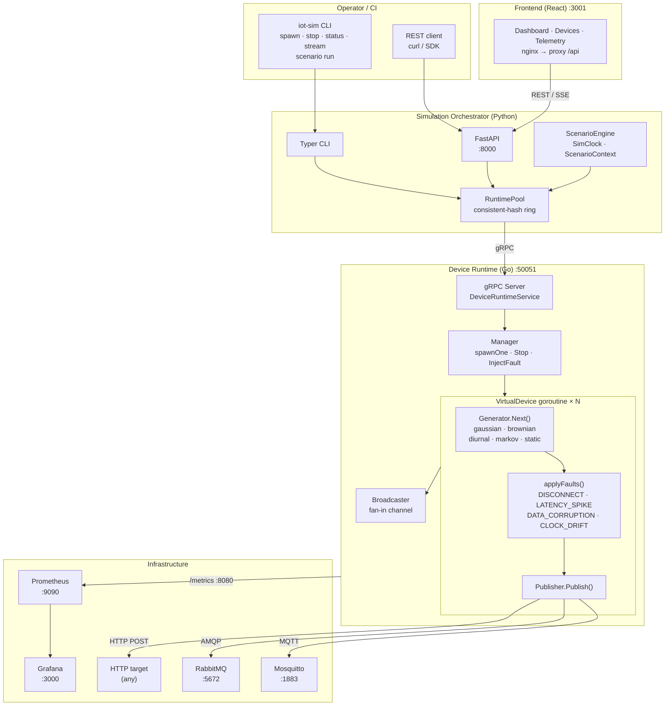

# Virtual IoT Simulator

A large-scale IoT device simulator capable of running thousands of concurrent virtual devices that generate realistic telemetry and publish it over configurable protocols.

The system is composed of three services:

- **Device Runtime** (Go) — the data plane. Runs one goroutine per device, generates telemetry, and streams it over the configured protocol adapter.
- **Simulation Orchestrator** (Python) — the control plane. Loads device profiles, manages the fleet lifecycle, and exposes both a CLI and a REST API.
- **Frontend** (React + TypeScript) — a web dashboard for controlling the fleet and observing live telemetry via the orchestrator REST API.

> **Status:** All phases complete. See [docs/SYSTEM.md](docs/SYSTEM.md) for the full design document.

---

## System Overview

```text
 ┌─────────────────────────────────────────────────────────────────────────┐
 │                        Operator / CI                                    │
 │                                                                         │
 │   iot-sim spawn / stop / status / stream      REST API :8000            │
 │   iot-sim scenario run ramp_up.py             POST /api/v1/devices/...  │
 └──────────────┬──────────────────────────────────────┬───────────────────┘
                │ gRPC (SpawnDevices, StopDevices,      │ HTTP / SSE
                │ InjectFault, StreamTelemetry …)       │
 ┌──────────────▼───────────────────────────────────────▼───────────────────┐
 │                  Simulation Orchestrator  (Python)                        │
 │                                                                           │
 │  ┌─────────────┐  ┌──────────────┐  ┌───────────────┐  ┌─────────────┐  │
 │  │  Typer CLI  │  │  FastAPI app │  │  RuntimePool  │  │  Scenario   │  │
 │  │  (cli.py)   │  │  (api.py)    │  │  (pool.py)    │  │  Engine     │  │
 │  └──────┬──────┘  └──────┬───────┘  └───────┬───────┘  │ (scenario  │  │
 │         └────────────────┴──────────────────►│          │  .py)      │  │
 │                                              │          └─────────────┘  │
 │                             consistent-hash ring                          │
 └──────────────────────────────────┬───────────────────────────────────────┘
                                    │ gRPC :50051
 ┌──────────────────────────────────▼───────────────────────────────────────┐
 │                    Device Runtime  (Go)                                   │
 │                                                                           │
 │  ┌──────────────────────────────────────────────────────┐                 │
 │  │  Manager                                             │                 │
 │  │   spawnOne() ──► VirtualDevice goroutine × N         │                 │
 │  │                  ┌─────────────────────────────┐     │                 │
 │  │                  │  ticker → Generator.Next()  │     │                 │
 │  │                  │  applyFaults()              │     │                 │
 │  │                  │  Publisher.Publish()        │     │                 │
 │  │                  └──────────────┬──────────────┘     │                 │
 │  │                                 │ fan-in chan         │                 │
 │  │  Broadcaster ◄──────────────────┘                    │                 │
 │  └──────────────────────────────────────────────────────┘                 │
 │                                                                           │
 │  ┌──────────────┐  ┌──────────────┐  ┌──────────────┐                    │
 │  │  MQTT pool   │  │  HTTP POST   │  │  AMQP chan   │  ← protocol        │
 │  │  (paho)      │  │  (net/http)  │  │  pool        │    adapters        │
 │  └──────┬───────┘  └──────┬───────┘  └──────┬───────┘                    │
 │         │                 │                  │                            │
 │  :8080 /metrics (Prometheus)    /healthz  /readyz                         │
 └─────────┼─────────────────┼─────────────────┼──────────────────────────-─┘
           │                 │                  │
 ┌─────────▼─────┐   ┌───────▼──────┐   ┌──────▼───────┐   ┌─────────────┐
 │   Mosquitto   │   │  HTTP target │   │   RabbitMQ   │   │  Prometheus │
 │   :1883       │   │  (any)       │   │   :5672      │   │  :9090      │
 └───────────────┘   └──────────────┘   └──────────────┘   └──────┬──────┘
                                                                   │
                                                            ┌──────▼──────┐
                                                            │   Grafana   │
                                                            │   :3000     │
                                                            └─────────────┘
```

**Data generators** (per telemetry field, seeded deterministically):
`gaussian` · `static` · `brownian` (Ornstein-Uhlenbeck) · `diurnal` (sinusoidal) · `markov` (state machine)

**Fault injection** (applied per device tick):
`DISCONNECT` · `LATENCY_SPIKE` · `DATA_CORRUPTION` · `BATTERY_DRAIN` · `CLOCK_DRIFT`



---

## Repository Layout

```text
.
├── device-runtime/          # Go gRPC server + virtual device engine
│   ├── cmd/runtime/         # Binary entry point
│   └── internal/
│       ├── device/          # VirtualDevice, Manager, RuntimeClock
│       ├── generator/       # Gaussian, Static generators + factory
│       ├── protocol/        # Publisher interface + Console adapter
│       └── server/          # gRPC handlers, Broadcaster, interceptors
├── orchestrator/            # Python orchestrator
│   ├── orchestrator/
│   │   ├── api.py           # FastAPI REST app
│   │   ├── cli.py           # Typer CLI (iot-sim)
│   │   ├── config.py        # Profile loader + Pydantic validation
│   │   └── grpc_client.py   # Typed async gRPC client
│   ├── tests/
│   ├── Pipfile              # Pipenv dependency manifest
│   └── pyproject.toml       # Package metadata + entry points
├── frontend/                # React + TypeScript web dashboard
│   ├── src/
│   │   ├── api/             # TanStack Query hooks + fetch client
│   │   ├── components/      # Shared MUI layout components
│   │   └── pages/           # Dashboard, Devices, Telemetry pages
│   ├── package.json
│   └── vite.config.ts       # Dev server with /api proxy to :8000
├── proto/simulator/v1/      # Protobuf definitions (source of truth)
├── profiles/                # Device profile YAML files
├── deployments/             # Docker Compose, Dockerfiles, nginx config
├── docs/SYSTEM.md           # Full technical design document
├── IMPLEMENTATION_PLAN.md   # Phase-by-phase implementation plan
├── buf.yaml                 # Buf lint/breaking-change config
└── Makefile                 # Build, test, and code-gen targets
```

---

## Prerequisites

| Tool | Version | Purpose |
| ---- | ------- | ------- |
| Docker + Compose | ≥ 24 | Run the full stack |
| Go | ≥ 1.21 | Device runtime (local dev) |
| Python | ≥ 3.12 | Orchestrator (local dev) |
| Node.js | ≥ 20 | Frontend (local dev) |
| pipenv | latest | Python dependency management |
| buf | latest | Protobuf linting and code generation |

---

## Quick Start

### Docker (recommended)

The entire stack — runtime, orchestrator, frontend, MQTT broker, Prometheus, and Grafana — starts with a single command:

```bash
docker compose -f deployments/docker-compose.yaml up --build
```

| Service | URL | Description |
| ------- | --- | ----------- |
| Frontend | [http://localhost:3001](http://localhost:3001) | React dashboard |
| Orchestrator API | [http://localhost:8000](http://localhost:8000) | FastAPI + Swagger UI at `/docs` |
| Runtime admin | [http://localhost:8080](http://localhost:8080) | `/healthz` · `/readyz` · `/metrics` |
| Grafana | [http://localhost:3000](http://localhost:3000) | Dashboards (admin / admin) |
| Prometheus | [http://localhost:9090](http://localhost:9090) | Metrics explorer |

Startup order is enforced via healthcheck dependencies:
`mosquitto` → `runtime` → `orchestrator` → `frontend`

---

### Local Development

#### 1. Generate protobuf code

```bash
make proto-gen
```

This runs `buf generate` for Go and `grpc_tools.protoc` for Python, writing generated files to `device-runtime/gen/go/` and `orchestrator/gen/python/`.

### 2. Start the Device Runtime

```bash
make go-build
./device-runtime/runtime --port 50051 --admin-port 8080 --log-level info
```

The runtime exposes:

- `:50051` — gRPC (`DeviceRuntimeService`)
- `:8080` — Admin HTTP (`/healthz`, `/readyz`)

### 3. Install Python dependencies

```bash
cd orchestrator
pipenv install
```

### 4. Install Frontend dependencies

If you have Node.js ≥ 20 installed locally:

```bash
cd frontend
npm install
```

**If Node.js is not installed locally**, use Docker to install packages or generate the lock file:

```bash
# Generate / update package-lock.json
docker run --rm -v "$(pwd)/frontend:/app" -w /app node:20-alpine npm install

# Install packages only (no node_modules on host, lock file only)
docker run --rm -v "$(pwd)/frontend:/app" -w /app node:20-alpine npm install --package-lock-only
```

This is also required when adding new packages so that `package-lock.json` stays in sync before running `make docker-build`.

### 5. Control devices via CLI

```bash
# Spawn 5 temperature sensors
pipenv run iot-sim spawn --profile ../profiles/temperature_sensor.yaml --count 5

# Check fleet status
pipenv run iot-sim status

# Stream live telemetry to the terminal
pipenv run iot-sim stream --type temperature_sensor

# Stop all devices
pipenv run iot-sim stop --all
```

### 6. Control devices via the REST API

```bash
# Start the API server (default: http://localhost:8000)
pipenv run iot-sim serve

# Spawn devices
curl -X POST http://localhost:8000/api/v1/devices/spawn \
  -H "Content-Type: application/json" \
  -d '{"profile": "../profiles/temperature_sensor.yaml", "count": 5}'

# Fleet status
curl http://localhost:8000/api/v1/devices/status

# Stream telemetry (SSE)
curl -N "http://localhost:8000/api/v1/devices/stream?device_type=temperature_sensor"

# Stop all
curl -X POST http://localhost:8000/api/v1/devices/stop \
  -H "Content-Type: application/json" \
  -d '{"all": true}'
```

Interactive API docs (Swagger UI) are available at `http://localhost:8000/docs`.

---

## Device Profiles

Profiles are YAML files in `profiles/` that define a device type's telemetry schema, protocol, and generator configuration. See [docs/DEVICE_PROFILES.md](docs/DEVICE_PROFILES.md) for the full reference.

---

## Development

### Run tests

```bash
# Go
make go-test

# Python
cd orchestrator && pipenv run pytest tests/ -v
```

### Makefile targets

| Target | Description |
| ------ | ----------- |
| `make proto-gen` | Generate Go + Python code from `.proto` files |
| `make proto-lint` | Lint proto files with Buf |
| `make proto-breaking` | Check for breaking changes against `main` |
| `make go-build` | Build the runtime binary |
| `make go-test` | Run Go tests |
| `make py-test` | Run Python tests |
| `make all` | Lint → generate → build → test (all) |

---

## Documentation

- [docs/SYSTEM.md](docs/SYSTEM.md) — full technical design: architecture, data models, concurrency model, API reference, and implementation status per phase.
- [docs/DEVICE_PROFILES.md](docs/DEVICE_PROFILES.md) — device profile YAML reference with all fields and generator types.
